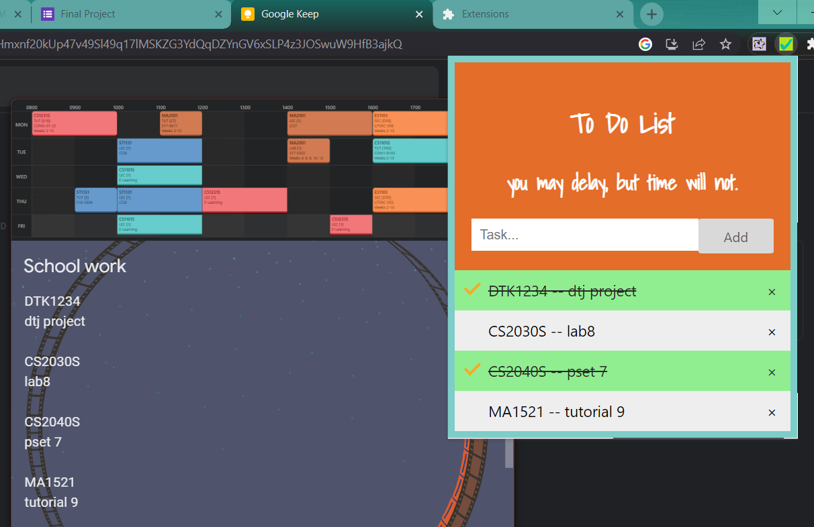

# To Do List Chrome Extension
#### Video Demo:  https://www.youtube.com/watch?v=x_FNdBSpBXE
#### Description: To Do List Chrome Extension made on 4/5/2023 to boost productivity. An intro video for CS50 Final Project.

## Table of Contents

- [Motivation](#motivation)
- [Installation](#installation)
- [Usage](#usage)
- [TechStack](#TechStack)
- [MovingForward](#MovingForward)

## Motivation
Prior to this project, I often jot down the tasks I want to complete in Google Keep or Notepad when I am on my computer. Nonetheless, I found it very troublesome to keep alternating tabs or apps to track my taskings. Hence, I thought it would be a good idea to have a chrome extension that allows me to record my to do list. An additional setback of using notepad would be to save the notes every single time. With this chrome extension, I will not need to do manual saving as the tasks are all stored in the local storage. Hence, I can carry on with my to do list without worrying about this.

## Installation

In summary, the installation is simple which comprises of downloading some files. There is an image folder, a json file, html file, css file and js file required for the installation. After downloading them, go to [extensions] (chrome://extensions/) and on developer mode. Unpack the folder downloaded and activate the extension.
You may pin the extension for convenience.

## Usage

There are a few basic functionalities. They are task adding, task checking and task removing. The usage should be intuitive. You may be reminded that the tasks are stored in local storage. Hence, your added tasks will remain on the list even after chrome is closed, unless it is removed with the 'x' button.

## TechStack

As mentioned, the extension is mainly built around javascript, html and css. local storage is also used to store the tasks in the list. In addition to the current tech stack, there could be external database used to store the data in case the plans moving forward will take up larger memory.

## MovingForward

Users can customise their to do list with the given code as they wish. If you would like to contribute your idea, please contact.
Moving forward, there could be additional features.
First, the clear button that allows every tasks in the list to be cleared at once, instead of removing them one by one.
Second, a tag and filter feature to sort the tasks at hand with customisable type or priority (similar to that of notion).
Third, I could make a swiper to change the Quote Of The Day to motivate users of the to do list.

